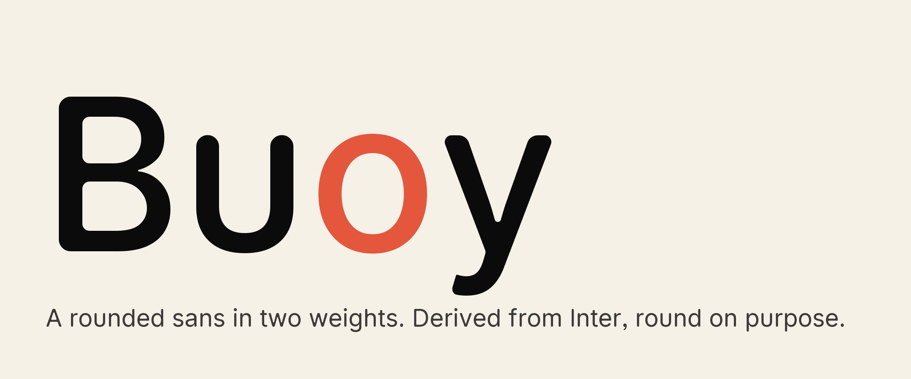

# Buoy

A rounded sans in two weights, derived from Inter 4.1. Every terminal is a
semicircle. Every figure lines up. Free under the SIL Open Font License.



Live specimen: <https://galangster.github.io/buoy/>

## Download

The current release is `release/v1.002/`:

The web files are a Latin subset. Kerning, tabular and proportional figures, fractions, the slashed zero, the I and l disambiguation set and the three alternate toggles are all kept; Inter’s other stylistic sets and character variants are not in the web build.

| file | for | bytes |
| --- | --- | ---: |
| `Buoy-Regular.woff2` | the web, Latin subset | 34,000 |
| `Buoy-Medium.woff2` | the web | 35,672 |
| `Buoy-Regular.ttf` | desktop, print, server-side rendering | 384,756 |
| `Buoy-Medium.ttf` | desktop, print, server-side rendering | 391,176 |

Each release also carries `OFL.txt`, `NOTICE.md` (what was changed, and from
which Inter commit), `FONTLOG.txt` (the change log) and `manifest.json`
(SHA-256 per file, the build parameters and the tool versions).

## Use it on the web

```css
@font-face {
  font-family: "Buoy";
  font-weight: 400;
  src: url(fonts/Buoy-Regular.woff2) format("woff2");
  font-display: swap;
}
@font-face {
  font-family: "Buoy";
  font-weight: 500;
  src: url(fonts/Buoy-Medium.woff2) format("woff2");
  font-display: swap;
}
body    { font-family: "Buoy", "Buoy Fallback", sans-serif; font-synthesis: none; }
.amount { font-variant-numeric: tabular-nums; }
.hash   { font-feature-settings: "tnum", "zero", "ss02"; }
```

`docs/fallback.css` declares a metric-matched `Buoy Fallback` over Arial and
Helvetica Neue, so text does not shift when the real font arrives. It is
generated by `tools/fallback.py` from the font's own metrics.

Buoy has two weights and no italic, so turn font synthesis off. A browser
asked for bold or italic will otherwise smear or slant the outlines itself.

## Features

| tag | what it does | default |
| --- | --- | --- |
| `kern` | kerning, Inter's | on |
| `calt` | contextual alternates | on |
| `tnum` | tabular figures | off; switch it on for any column of numbers |
| `zero` | slashed zero | off |
| `ss02` | disambiguated I, l, ß and 0 | off |
| `case` | case-sensitive punctuation | off |
| `frac` | fractions | off |
| `cv02` | closed four, Inter's drawing | off; Buoy's open four is the default |
| `cv06` | spurred u, Inter's drawing | off; Buoy's spurless u is the default |
| `ss03` | sharp quotes and commas, Inter's | off; Buoy's round ones are the default |

## How it is made

Buoy is Inter 4.1 with every hard corner replaced by a tangent circular arc.
The radius is a ratio of the measured stem of each weight, 0.50 outside and
0.30 inside, so terminals stay semicircular at both weights. Three of Inter's
alternates are promoted to the default drawing: the open four, the spurless u,
and the round quotes and commas. Nothing is redrawn by hand, so Inter's
kerning, features and vertical metrics come along unchanged.

The rounding is a [ufo2ft](https://github.com/googlefonts/ufo2ft) filter in
`tools/round_filter.py`. Every ruled value lives in `tools/params.py` and
nowhere else: outer radius 0.50 of the measured stem, inner 0.30, minimum
corner angle 14 degrees, visual correction 0.25. The stems are the bounding
box width of `I` in the flat instance, 190 Regular and 229 Medium at 2048
units per em.

| tool | what it does |
| --- | --- |
| `round_filter.py` | the corner rounding, and the filter that promotes an alternate to default |
| `build.py` | drives fontmake: interpolation first, rounding second |
| `finish.py` | names, vendor ID, weight class, `gasp`, the clipping box |
| `measure.py` | stems, the point-parity gate, the self-intersection gate |
| `shape_proof.py` | every feature in the table above proved by shaping, not by reading a table |
| `subset.py` | the Latin web subset, and the proof that it kept every feature it names |
| `release.py` | the release directory, the manifest, the notices |
| `fallback.py` | the metric-matched fallback CSS |
| `proof.py` | the proof sheets and the specimen page |

## Building from source

```bash
python3 -m venv .venv && .venv/bin/pip install -r requirements.txt
git clone https://github.com/rsms/inter vendor/inter
git -C vendor/inter checkout 353b61b9f4430d5f420d56605a6e7993e0941470
brew install harfbuzz                          # hb-shape, for the proofs

.venv/bin/python tools/build.py release        # interpolate, then round
.venv/bin/python tools/finish.py               # names, tables, the clipping box
.venv/bin/python tools/release.py              # subset, woff2, release/, manifest
.venv/bin/python tools/proof.py                # rendered proof sheets
```

Builds are reproducible. `finish.py` pins `head.modified` to `head.created`,
so two runs over the same inputs give byte-identical files; compare them with
`shasum -a 256 release/v1.002/Buoy-*`. `vendor/`, `build/` and the virtualenv
are gitignored. `release/` and `proof/` are committed.

## Gates

Every release passes these before it is sealed. The record for the current
release is `proof/2026-09-05-v1.002/gates.md`.

```bash
.venv/bin/fontbakery check-opentype  -l FAIL release/v1.002/*.ttf   # 0 FAIL
.venv/bin/fontbakery check-universal -l FAIL release/v1.002/*.ttf   # 3 inherited from Inter, x2 fonts
.venv/bin/python tools/measure.py parity  --variants release        # point parity with the flat instance
.venv/bin/python tools/measure.py compare --variants release        # 0 self-intersections introduced
.venv/bin/python tools/shape_proof.py                               # features proved on the TTFs
.venv/bin/python tools/shape_proof.py --fonts release/v1.002/*.woff2 --no-outline-proof
.venv/bin/python tools/subset.py --list-ranges                      # the Unicode blocks the web build keeps
```

The three inherited `check-universal` failures are `base_has_width`,
`case_mapping` and `transformed_components`. Each one fails identically on
Inter itself, and every glyph involved is outside the Latin web subset.

## Status

Version 1.002 is production ready for the web on macOS, iOS, Android and
Linux. Still open:

- Windows rendering (DirectWrite) is unproved. The fonts are unhinted with
  `gasp` set to grayscale and symmetric smoothing, which is the correct
  unhinted setting; a screenshot pass on Windows 11 is the remaining check.
- No hand pass. The identity glyphs, bone-effect blunting at stem ends and
  terminal overshoot are all still mechanical.
- No italic, no display cut, no variable font. At two weights, two static
  files are smaller than one variable font.
- Four segments in Regular and ten in Medium still round to zero length. The
  corner filter prunes its own collapsed arcs, but the cubic to quadratic
  conversion runs after it and makes a few more. They draw no pixel.
- A glyph carrying both contours and components is rounded on its contour part
  only, and the overlap between the two parts is not removed first.
- Combining marks are not in the web subset. `tools/subset.py
  --combining-marks` adds them for decomposed text, at about 9 KB per file.

## License

Buoy is licensed under the SIL Open Font License, Version 1.1. See `LICENSE`.

Buoy is Copyright (c) 2026 The Creative Company, and is a modified version of
[Inter](https://github.com/rsms/inter), Copyright (c) 2016 The Inter Project
Authors. Inter's copyright notice declares no Reserved Font Name, so this
derivative is free to carry a name of its own. Inter is a trademark of Rasmus Andersson, and no word of it appears
in this family's name.
