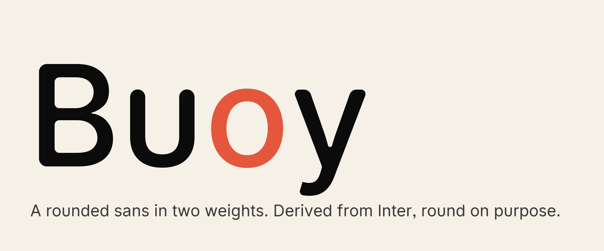

# Buoy

A rounded sans in two weights, derived from Inter 4.1. Every terminal is a
semicircle. Every figure lines up. Free under the SIL Open Font License.



Live specimen: <https://galangster.github.io/buoy/>

## Download

The release candidate is `release/v1.003/`. The latest published,
immutable release remains `v1.002` until this candidate is reviewed and
published.

The web files are a Latin subset with combining diacritical marks. Kerning,
mark attachment, tabular and proportional figures, fractions, the slashed
zero, the I and l disambiguation set and the three alternate toggles are kept.
Inter's other stylistic sets and character variants are not in the web build.

| file | for | bytes |
| --- | --- | ---: |
| `Buoy-Regular.woff2` | the web, Latin plus combining marks | 43,112 |
| `Buoy-Medium.woff2` | the web, Latin plus combining marks | 45,444 |
| `Buoy-Regular-Latin.ttf` | server-side Latin share images | 116,620 |
| `Buoy-Medium-Latin.ttf` | server-side Latin share images | 118,168 |
| `Buoy-Regular.ttf` | full desktop and print font | 384,752 |
| `Buoy-Medium.ttf` | full desktop and print font | 391,164 |

Each release also carries `OFL.txt`, `NOTICE.md` (what was changed, and from
which Inter commit), `FONTLOG.txt` (the change log) and `manifest.json`
(SHA-256 per file, the build parameters and the tool versions).

## Use it on the web

```css
@font-face {
  font-family: "Buoy";
  font-weight: 400;
  src: url(fonts/Buoy-Regular.woff2) format("woff2");
  font-display: swap;
}
@font-face {
  font-family: "Buoy";
  font-weight: 500;
  src: url(fonts/Buoy-Medium.woff2) format("woff2");
  font-display: swap;
}
body    { font-family: "Buoy", "Buoy Fallback", sans-serif; font-synthesis: none; }
.amount { font-variant-numeric: tabular-nums; }
.hash   { font-feature-settings: "tnum", "zero", "ss02"; }
```

`docs/fallback.css` declares a metric-adjusted `Buoy Fallback` over Arial and
Helvetica Neue. It preserves the line metrics. In the recorded Arial sample,
it reduces the line-width difference to 0.72%. Text near a wrap boundary can
still reflow when Buoy arrives. The file is generated by `tools/fallback.py`.

Buoy has two weights and no italic, so turn font synthesis off. A browser
asked for bold or italic will otherwise smear or slant the outlines itself.

## Features

| tag | what it does | default |
| --- | --- | --- |
| `kern` | kerning, Inter's | on |
| `calt` | contextual alternates | on |
| `ccmp` | composition and dot removal before above marks | on |
| `mark` | attaches a combining mark to its base | on |
| `mkmk` | stacks one combining mark on another | on |
| `tnum` | tabular figures | off; switch it on for any column of numbers |
| `zero` | slashed zero | off |
| `ss02` | disambiguated I, l, ß and 0 | off |
| `case` | case-sensitive punctuation | off |
| `frac` | fractions | off |
| `cv02` | closed four, Inter's drawing | off; Buoy's open four is the default |
| `cv06` | spurred u, Inter's drawing | off; Buoy's spurless u is the default |
| `ss03` | sharp quotes and commas, Inter's | off; Buoy's round ones are the default |

## How it is made

Buoy is Inter 4.1 with every hard corner replaced by a tangent circular arc.
The radius is a ratio of the measured stem of each weight, 0.50 outside and
0.30 inside, so terminals stay semicircular at both weights. Three of Inter's
alternates are promoted to the default drawing: the open four, the spurless u,
and the round quotes and commas. Nothing is redrawn by hand, so Inter's
kerning, features and vertical metrics come along unchanged.

The rounding is a [ufo2ft](https://github.com/googlefonts/ufo2ft) filter in
`tools/round_filter.py`. Every ruled value lives in `tools/params.py` and
nowhere else: outer radius 0.50 of the measured stem, inner 0.30, minimum
corner angle 14 degrees, visual correction 0.25. The stems are the bounding
box width of `I` in the flat instance, 190 Regular and 229 Medium at 2048
units per em.

| tool | what it does |
| --- | --- |
| `round_filter.py` | the corner rounding, and the filter that promotes an alternate to default |
| `build.py` | drives fontmake: interpolation first, rounding second |
| `finish.py` | names, vendor ID, weight class, `gasp`, the clipping box |
| `measure.py` | stems, the point-parity gate, the self-intersection gate |
| `shape_proof.py` | every feature in the table above proved by shaping, not by reading a table |
| `subset.py` | the Latin subsets, canonical closure and required-feature checks |
| `release.py` | the release directory, the manifest, the notices |
| `fallback.py` | the metric-matched fallback CSS |
| `proof.py` | the proof sheets and the specimen page |

## Building from source

```bash
python3 -m venv .venv && .venv/bin/pip install -r requirements.txt
git clone https://github.com/rsms/inter vendor/inter
git -C vendor/inter checkout 353b61b9f4430d5f420d56605a6e7993e0941470
brew install harfbuzz                          # hb-shape, for the proofs

.venv/bin/python tools/build.py release        # interpolate, then round
.venv/bin/python tools/finish.py               # names, tables, the clipping box
.venv/bin/python tools/release.py              # web and OG subsets, release/, manifest
.venv/bin/python tools/proof.py                # rendered proof sheets
```

Builds are reproducible. `finish.py` pins `head.modified` to `head.created`,
so two runs over the same inputs give byte-identical files; compare them with
`shasum -a 256 release/v1.003/Buoy-*`. `vendor/`, `build/` and the virtualenv
are gitignored. `release/` and `proof/` are committed.

## Gates

Every release passes these before it is sealed. The local candidate record is
`proof/2026-09-06-v1.003/gates.md`.

```bash
.venv/bin/fontbakery check-opentype  -l FAIL release/v1.003/*.ttf
.venv/bin/fontbakery check-universal -l FAIL release/v1.003/Buoy-Regular.ttf release/v1.003/Buoy-Medium.ttf
.venv/bin/python tools/measure.py parity  --variants release        # point parity with the flat instance
.venv/bin/python tools/measure.py compare --variants release        # 0 self-intersections introduced
.venv/bin/python tools/shape_proof.py                               # features proved on the TTFs
.venv/bin/python tools/shape_proof.py --fonts release/v1.003/*.woff2 release/v1.003/*-Latin.ttf --no-outline-proof
.venv/bin/python tools/subset.py --list-ranges                      # the Unicode blocks the web build keeps
```

The three inherited `check-universal` failures are `base_has_width`,
`case_mapping` and `transformed_components`. The Latin TTFs also report
`case_mapping` and `transformed_components`, once per weight. The missing
case counterpart is U+214E. The transformed components are upstream
constructions and remain unhinted. See `latin-universal-summary.json` in the
candidate proof directory. These are documented failures, not passing checks.

## Status

Version 1.003 is a validated production candidate on the hardening branch. Its automated gates and proof
pages are recorded in its proof directory. A macOS browser inspection passed,
but that CUA capture is not stored in this repository. Platform capture
remains narrower than the font's intended use:

- Hosted Windows DirectWrite and Linux FreeType raster checks passed, with 192 runs each.
  Saved evidence is in `proof/2026-09-06-v1.003/native-raster/`. These use
  pre-shaped HarfBuzz runs and do not prove native browser shaping. Core Text on macOS is proved by
  capture in `proof/2026-09-05-v1.002/coretext-small-sizes.png`. The fonts are unhinted with
  `gasp` set to grayscale and symmetric smoothing, which is the correct
  unhinted setting, and `proof/2026-09-05-v1.002/render-risk.md` measures the
  rounding's cost at 11 to 18 px and finds it does not thin stems. A
  Windows browser check remains outside the validated scope.
- No hand pass. The identity glyphs, bone-effect blunting at stem ends and
  terminal overshoot are all still mechanical.
- No italic, no display cut, no variable font. At two weights, two static
  files are smaller than one variable font.
- Safari on the iOS 26.5 simulator passed the candidate cases. Captures are in
  `proof/2026-09-06-v1.003/platform-checks-2026-09-06/`. Physical iOS devices,
  Android, and Linux browser rendering remain unverified.
- Source glyphs that mix contours and components pass through overlap removal
  before rounding. The v1.003 evidence records their compiled state. No defect
  was found that justified changing those outlines.

## License

Buoy is licensed under the SIL Open Font License, Version 1.1. See `LICENSE`.

Buoy is Copyright (c) 2026 The Creative Company, and is a modified version of
[Inter](https://github.com/rsms/inter), Copyright (c) 2016 The Inter Project
Authors. Inter's copyright notice declares no Reserved Font Name, so this
derivative is free to carry a name of its own. Inter is a trademark of Rasmus Andersson, and no word of it appears
in this family's name.

Fable 5.1 approved the six frozen font artifacts. It placed the original
candidate archive on hold for a repackage. The successor archive still needs
an independent audit. No v1.003 release tag is published.
